# contratos-safra

Plataforma de contratos de safra entre produtores rurais e compradores — versão **Web** (React + Vite) e **Mobile** (Expo / React Native).

## Funcionalidades

- Cadastro e login de vendedores
- Criação de contratos de safra em **7 passos** (mobile) ou formulário completo (web)
- Máscaras de CPF/CNPJ e telefone
- Confirmação do contrato pelo comprador com link de validação
- Confirmação direta pelo vendedor com alerta de reconhecimento de firma em cartório
- Cálculo automático de valor total
- Visualização e impressão do contrato
- Tema escuro no app mobile
- Dados armazenados localmente (web: localStorage · mobile: cache local)

## Stack

| Camada | Tecnologia |
|---|---|
| Web | React 19, Vite, TypeScript, Tailwind CSS, shadcn/ui |
| Mobile | Expo SDK 57, React Native, React Navigation, expo-print |
| Persistência | localStorage / AsyncStorage (backend futuro) |

## Como rodar

### Web

```bash
cd contrato-safra
npm install
npm run dev
```

Acesse http://localhost:5173

### Mobile

```bash
cd contrato-safra-mobile
npm install
npx expo start
```

Escaneie o QR Code com o app **Expo Go** ou pressione `w` para abrir no navegador.

## Screenshots

### Web

| Login | Cadastro |
|---|---|
|  | 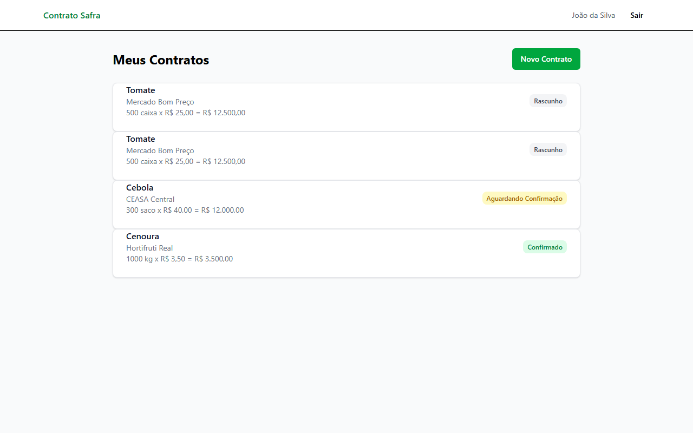 |

| Home — lista de contratos | Novo contrato |
|---|---|
| 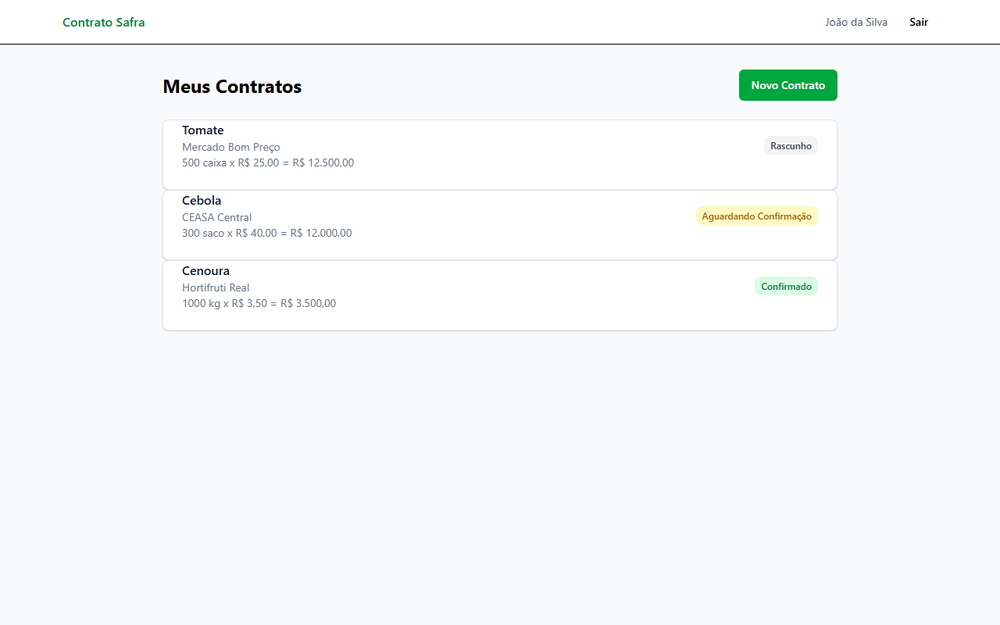 | 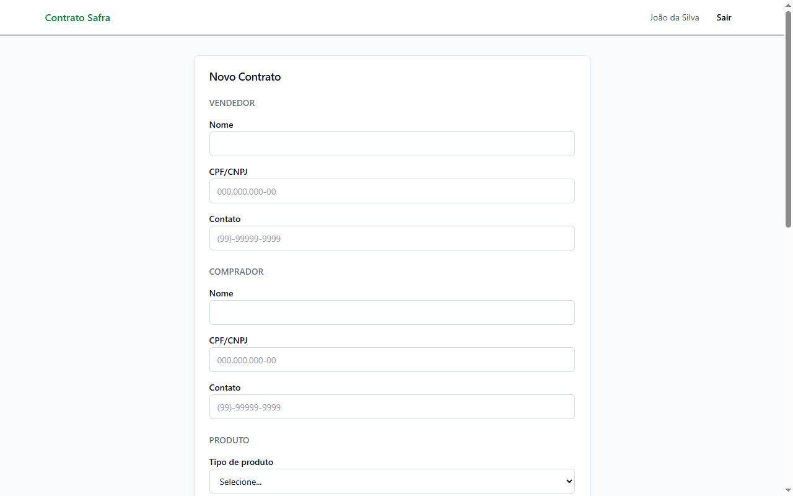 |

| Novo contrato preenchido | Detalhe do contrato |
|---|---|
| 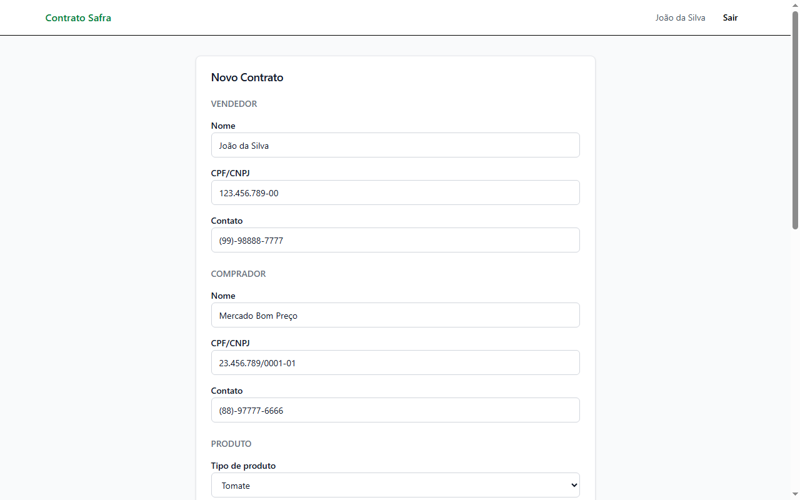 | 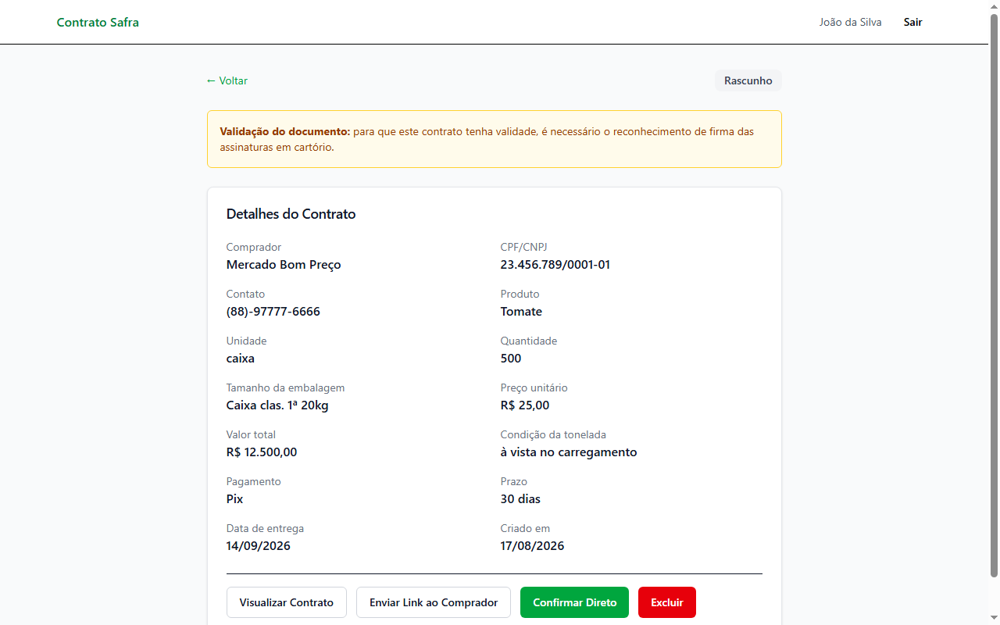 |

| Visualização do contrato |
|---|
| 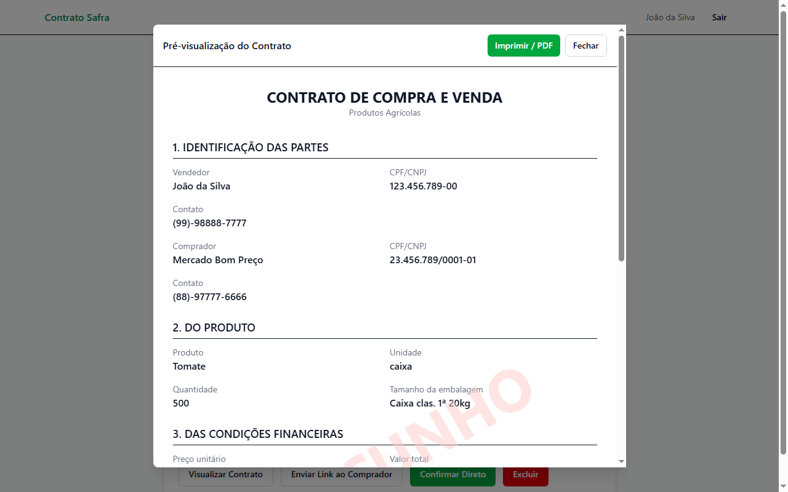 |

### Mobile

| Login | Cadastro |
|---|---|
| 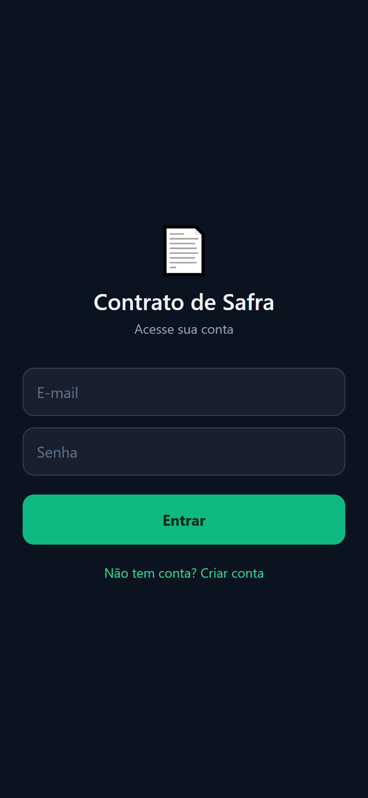 | 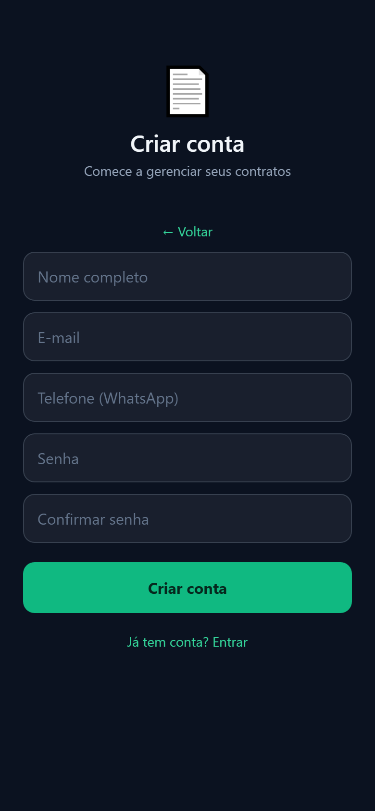 |

| Home | Passo 1 — Vendedor | Passo 2 — Comprador |
|---|---|---|
| 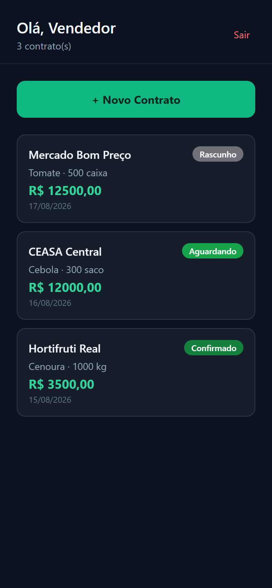 | 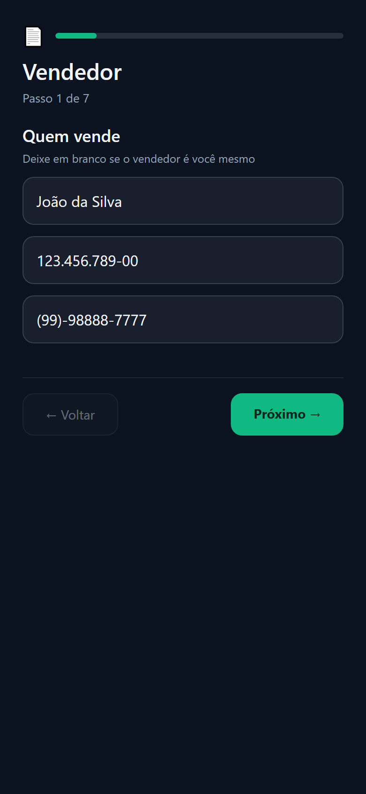 | 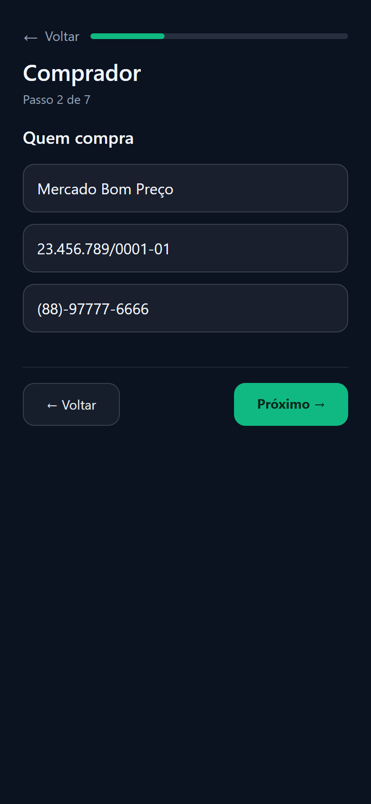 |

| Passo 3 — Cultura | Escolha da cultura | Escolha da unidade |
|---|---|---|
|  |  | 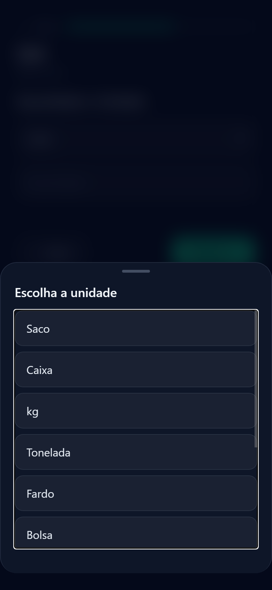 |

| Passo 4 — Quantidade | Passo 5 — Valor | Passo 6 — Pagamento |
|---|---|---|
| 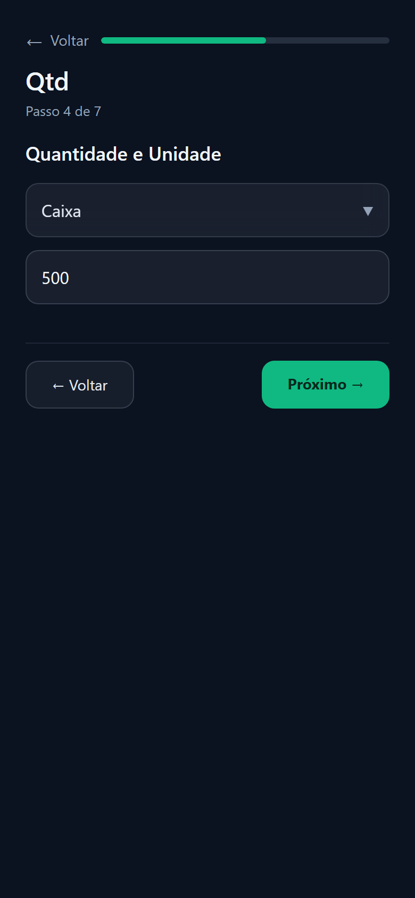 |  | 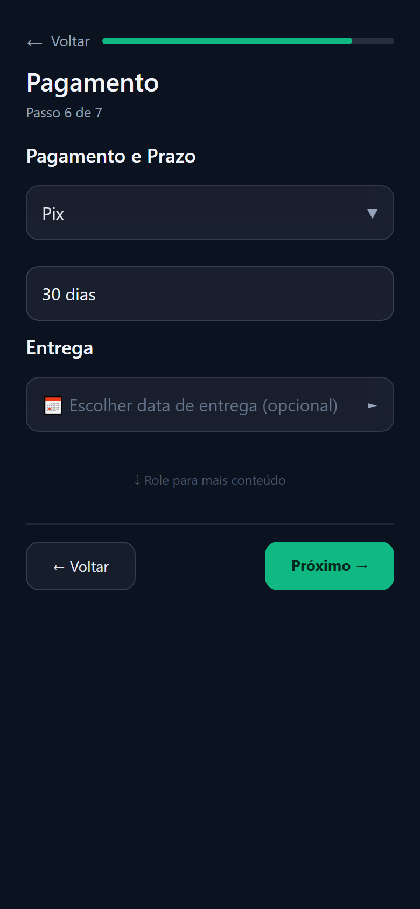 |

| Calendário de entrega | Pagamento preenchido | Passo 7 — Revisão |
|---|---|---|
| 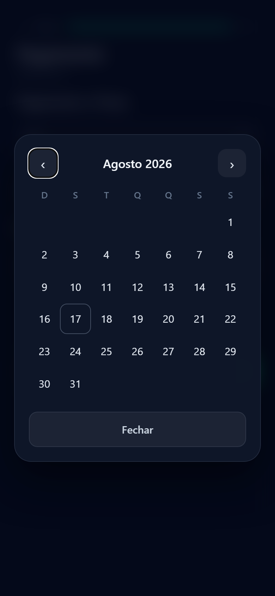 | 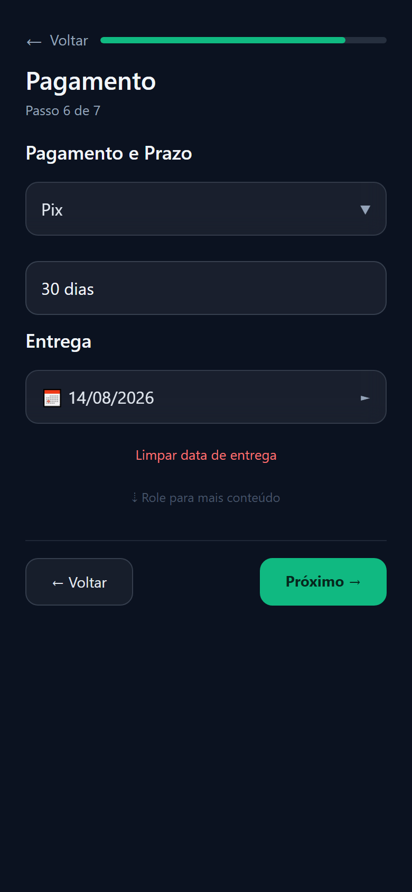 | 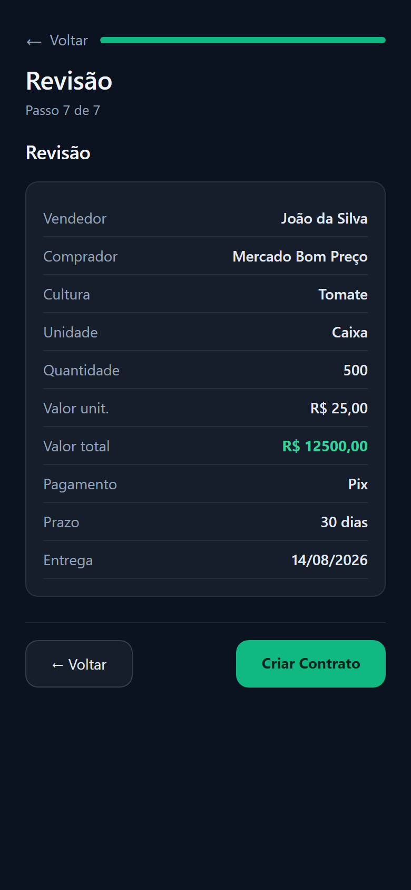 |

| Home após criar | Detalhe do contrato | Visualização do contrato |
|---|---|---|
|  | 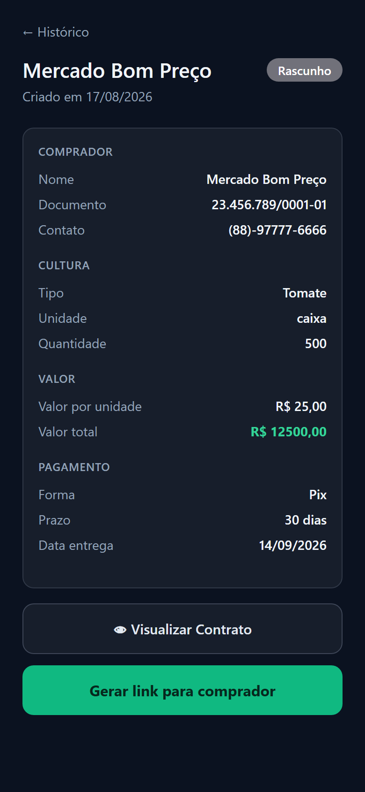 | 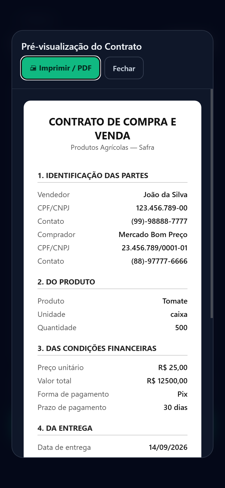 |